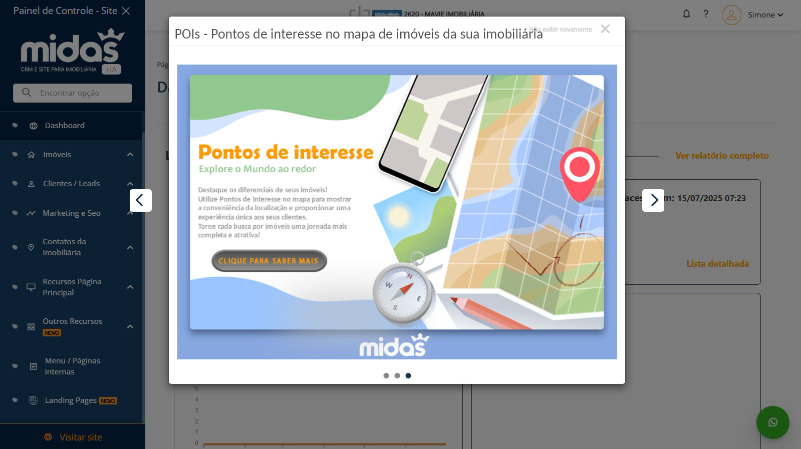
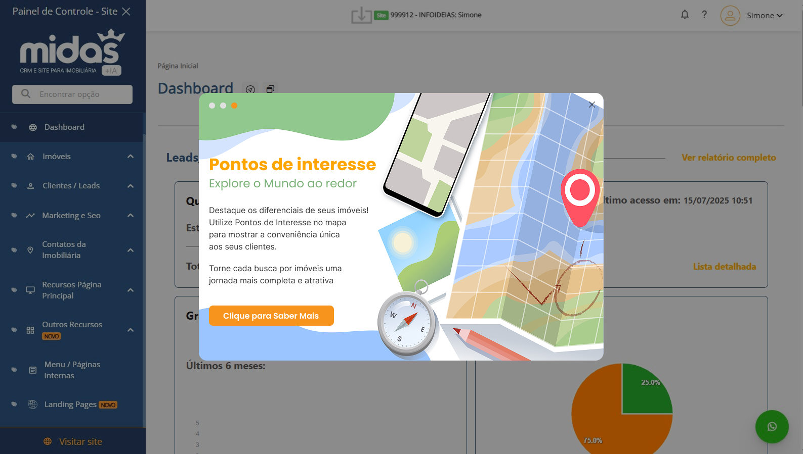

# 💡 Redesenho de Pop-up — Pontos de Interesse

## 🧩 Exercício 1 – Análise Crítica e Redesenho de Pop-up

Este projeto consiste na análise e redesenho de um pop-up informativo da plataforma Midas, com o objetivo de melhorar a legibilidade, hierarquia visual e experiência do usuário (UX), mantendo o plano de fundo original e o conteúdo textual e visual.

---

## 📸 Comparação Visual

### 🔹 Pop-up Original

### 🔸 Nova Versão Redesenhada

---

## 🧠 Análise Crítica da Proposta Original

A versão original apresenta uma composição funcional, mas com problemas em pontos-chave de UX e UI:

| Elemento                 | Problema identificado                                                   |
|--------------------------|--------------------------------------------------------------------------|
| Hierarquia Visual        | Título, subtítulo e texto muito próximos e sem contraste suficiente      |
| Alinhamento              | Botão desalinhado em relação ao bloco de texto                          |
| Botão CTA                | Estilo pouco destacado e cor com baixo contraste                        |
| Estrutura de Layout      | Falta de separação entre elementos e ausência de ritmo visual            |
| Navegação entre slides   | Indicadores de carrossel mal posicionados e pouco visíveis               |

---

## 🛠️ Justificativas para o Redesenho

Foi decidido redesenhar o pop-up por identificar várias oportunidades de aprimoramento visual e funcional:

- **Aplicar boas práticas de UX:** escaneabilidade, respiro visual e foco no CTA
- **Melhorar contraste e legibilidade** dos elementos principais
- **Adicionar carrossel no topo**, deixando o botão CTA livre de distrações
- **Reposicionar o botão de fechar (X)** de forma mais intuitiva
- **Atualizar a tipografia e espaçamento**, facilitando leitura rápida

---

## ✨ Melhorias Aplicadas

| Elemento               | Nova Solução Adotada                                                                 |
|------------------------|--------------------------------------------------------------------------------------|
| **Título e Subtítulo** | Maior contraste, tamanho maior, alinhamento claro                                   |
| **Texto**              | Quebras estratégicas e espaçamento de linha para facilitar leitura                   |
| **Botão CTA**          | Cor laranja vibrante, centralizado, com bom padding e bordas arredondadas           |
| **Layout**             | Estrutura dividida em 2 colunas: texto à esquerda e imagem à direita                |
| **Carrossel**          | Indicadores de slide posicionados no topo do pop-up, respeitando o fluxo visual      |
| **Estética geral**     | Aplicação de sombras leves, cantos arredondados e maior harmonia com o dashboard     |

---

## 📐 Layout Final com Foco em UX

- **Responsivo e visualmente limpo**
- **Hierarquia clara:** do título ao CTA
- **Atenção distribuída com leveza**
- **Melhor integração com o ambiente do dashboard**

---

## ✅ Conclusão

O redesenho foi essencial para tornar o pop-up mais moderno, acessível e funcional. Ele melhora a comunicação da informação e se integra visualmente de forma mais harmoniosa ao ambiente da aplicação, sem comprometer a identidade da marca.

---

## 🖼️ Arquivos

- `Pop-up-redesenhado.png` → Nova versão redesenhada
- `POPUP.jpg` → Versão original
